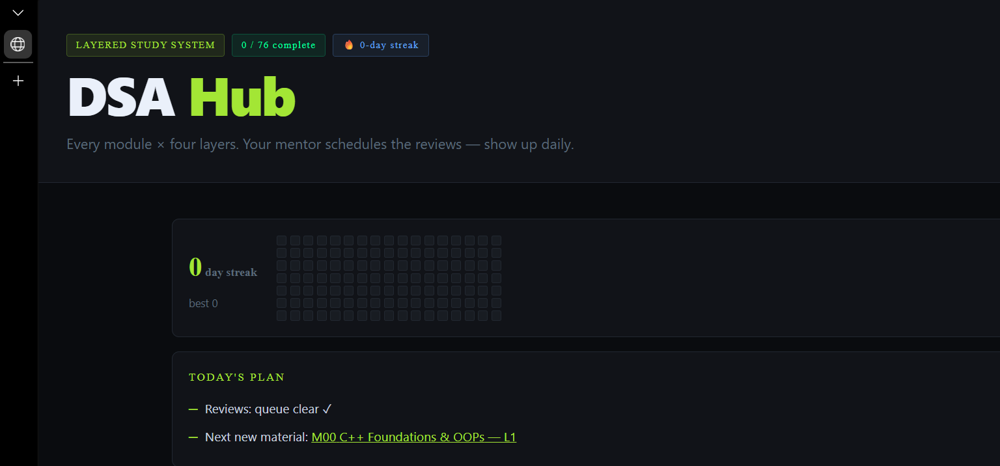
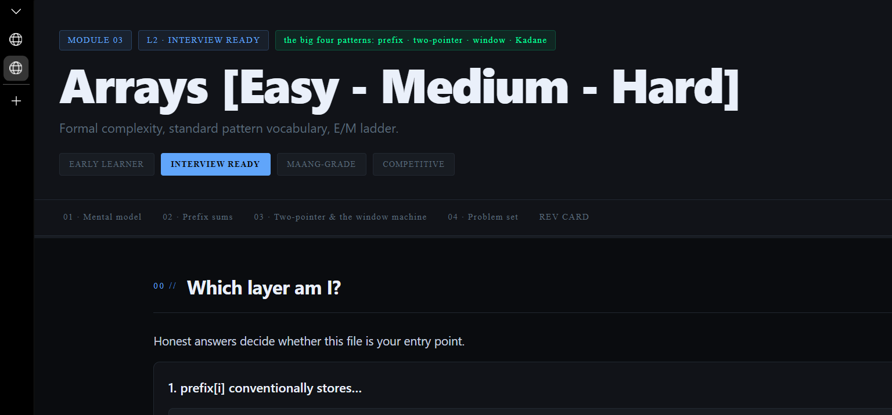
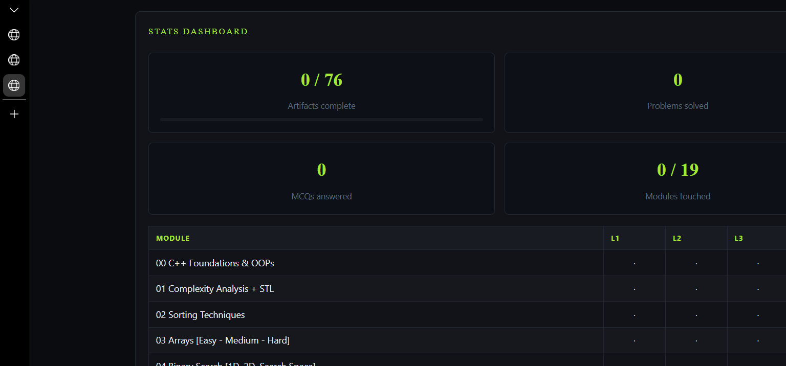

# DSA Layered Study System

[](https://github.com/INEEDTHATGT3/dsa-lms/actions/workflows/deploy.yml)
[](LICENSE)
[](https://react.dev/)
[](https://vitejs.dev/)

A self-paced Data Structures & Algorithms curriculum delivered as a single-page React app — 19 modules, each written at four difficulty tiers so the same topic can be studied as a zero-assumption primer or as constraint-driven competitive-programming material.

**Live app:** https://ineedthatgt3.github.io/dsa-lms/

## Screenshots

| Module hub | Lesson view | Progress stats |
|---|---|---|
|  |  |  |

## Features

- **19 modules, 4 tiers each (76 lessons)** — every topic is written once per difficulty level instead of once overall, so the same concept reads differently depending on what the learner is ready for.
- **Dependency-gated curriculum** — each module declares its prerequisite modules; the hub reflects what's actually unlocked instead of a flat list.
- **Spaced-repetition review** — a review queue and mistake log drive recall practice separate from first-pass lessons.
- **Timed sprint & interview modes** — drill sets under a clock, with a running pool-size indicator and outcome logging.
- **Per-lesson notes journal** — free-form notes saved alongside progress, scoped per lesson.
- **Progress analytics** — streaks, due-today counts, and a weakest-modules radar computed client-side from stored attempt history.
- **Zero backend** — the entire app is static; all state (progress, notes, mistakes, streaks) is persisted in the browser via `localStorage`.

## Curriculum

Ordered per the Striver A2Z sheet, with an added Module 00 foundations unit for learners starting from zero. Every module is available at four tiers:

| Level | Name | Promise |
|---|---|---|
| 1 | Early Learner | Zero-assumption mental models; step counting instead of Big-O; everyday analogies only. |
| 2 | Interview Ready | Formal complexity, standard pattern vocabulary, easy/medium ladder. |
| 3 | MAANG-Grade | Optimization trade-offs, internals, interviewer follow-up chains. |
| 4 | Competitive | Constraint math, CP machinery, templates, contest tactics. |

<details>
<summary>All 19 modules</summary>

| # | Module | Focus |
|---|---|---|
| 00 | C++ Foundations & OOPs | Pre-DSA: syntax, flowcharts→code, memory, functions, OOPs, maths, sieve |
| 01 | Complexity Analysis + STL | Big-O mastery, vectors/maps/sets, custom comparators |
| 02 | Sorting Techniques | Selection → bubble → insertion → merge → quick |
| 03 | Arrays | Two pointer, sliding window, prefix sum, Kadane |
| 04 | Binary Search | Classic BS, BS on answers (Aggressive Cows, Book Allocation, SPOJ EKO/PRATA) |
| 05 | Strings (Basic + Medium) | Manipulation, hashing on chars, anagrams, palindromes |
| 06 | Linked List | Reversal, cycles, merge, flatten, clone-with-random |
| 07 | Recursion (Pattern-wise) | Subsequences, combinations |
| 08 | Bit Manipulation | XOR tricks, masks, Brian Kernighan |
| 09 | Stacks & Queues | Implementations, infix/postfix, monotonic stack |
| 10 | Sliding Window & Two Pointer | Combined problems, variable windows |
| 11 | Heaps | k-th elements, merge heaps, median stream |
| 12 | Greedy Algorithms | Interval scheduling, N-meetings, jump game |
| 13 | Binary Trees | Traversals, diameter, LCA, path sums, serialize |
| 14 | Binary Search Trees | BST property, kth smallest, LCA in BST, BST↔heap |
| 15 | Graphs | BFS/DFS, topo sort, DSU, MST, shortest paths |
| 16 | Dynamic Programming | 1D/2D/knapsack/LIS/strings/partition DP, Kadane family |
| 17 | Tries | Insert/search/prefix, XOR-max trie |
| 18 | Strings (Advanced) | KMP, Z-algorithm, Rabin-Karp |

</details>

Problem sourcing: Striver A2Z sheet, FINAL450 (Babbar), and a local solutions archive.

## Tech stack

- [React 18](https://react.dev/) with [React Router 6](https://reactrouter.com/) (`HashRouter`, for GitHub Pages compatibility)
- [Vite 5](https://vitejs.dev/) for dev server and production builds
- [ESLint 9](https://eslint.org/) (flat config) for linting
- GitHub Actions → GitHub Pages for CI/CD
- No backend, no database — all persistence is client-side `localStorage`

## Getting started

Requires Node.js 20+.

```bash
npm install
npm run dev        # http://localhost:5173
```

### Build & lint

```bash
npm run build       # production build to dist/
npm run preview     # preview the production build locally
npm run lint         # ESLint over the whole project
```

## Deployment

Push to `main` → GitHub Actions validates lesson content, builds, and deploys to GitHub Pages automatically (see `.github/workflows/deploy.yml`).

Pages only needs to be enabled once, manually: repo **Settings → Pages → Source: GitHub Actions**.

## Content authoring workflow

Lesson content is authored in a separate local workspace (`content/` + `renderer/`), not committed to this repo directly. After editing a lesson there:

```bash
node renderer/lint.js              # content lint gate
node renderer/sync-content.mjs     # copy rendered JSON into this repo
git add src/content && git commit && git push
```

CI re-validates every lesson JSON (`scripts/validate-content.mjs`) before it ships, independent of the authoring-side lint.

## Progress & data

All progress, notes, mistake logs, and streaks are stored per-device in `localStorage` under the `dsa_progress_v1` key. Nothing is sent to a server — clearing site data resets progress. Cross-device sync is not implemented.

## Contributing

Contributions, bug reports, and content corrections are welcome — see [CONTRIBUTING.md](CONTRIBUTING.md). This project follows a [Code of Conduct](CODE_OF_CONDUCT.md).

## License

[MIT](LICENSE) © 2026 Dhruv Jaiswal
